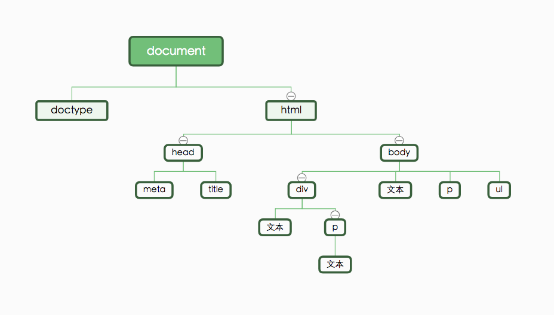
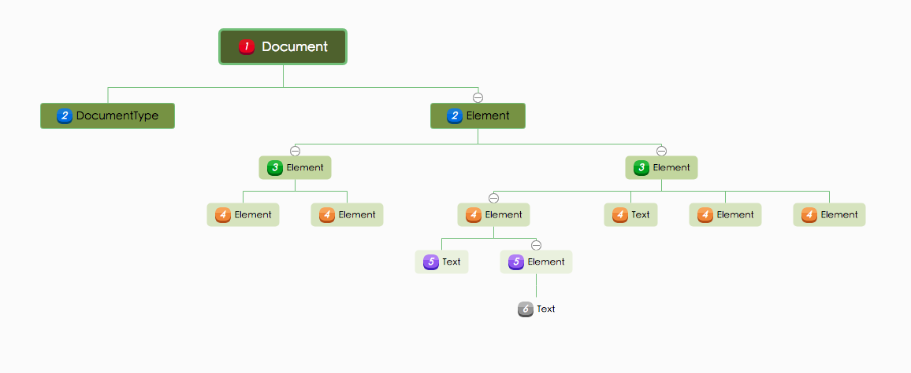
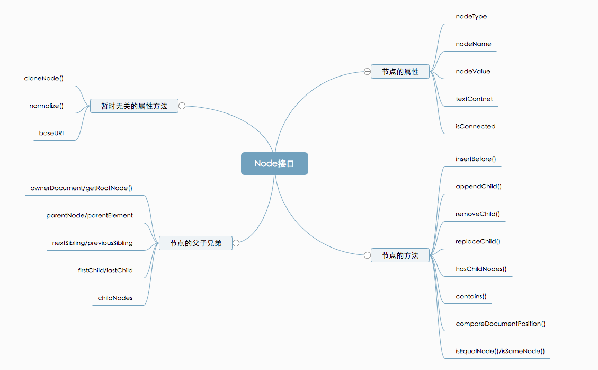
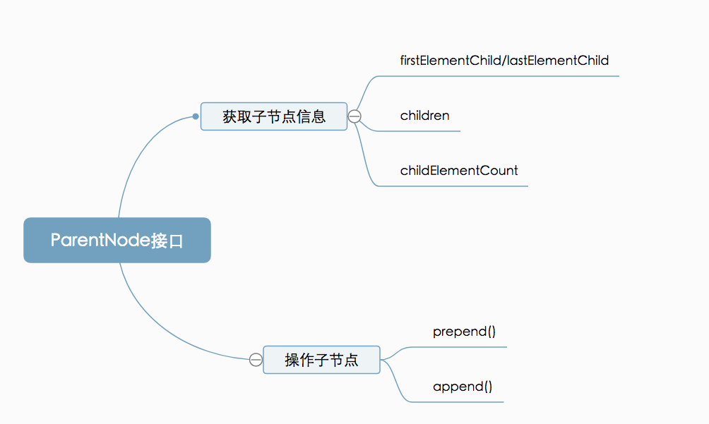
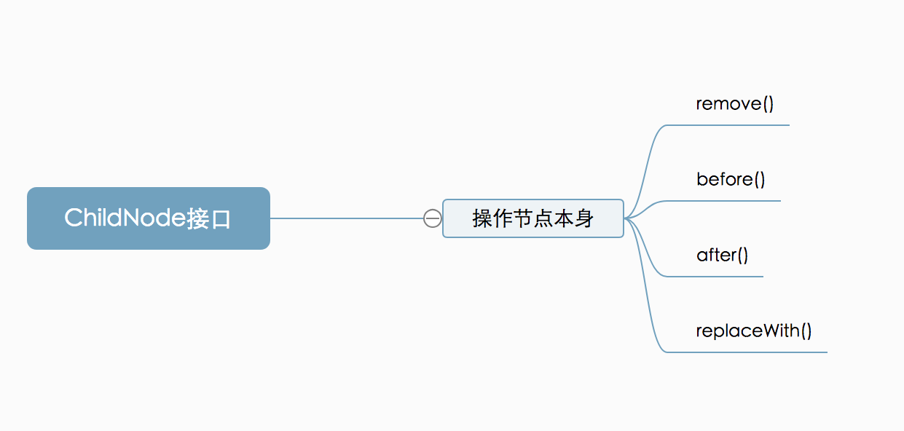

# DOM

在学习DOM之前，先大致了解一下DOM是个什么东西。

简单来说，DOM就是JavaScript用来操作文档的接口。HTML就属于文档的一种。

所以学习DOM的目的很明确，就是如何去操作文档。

------

> DOM里面的东西很多，还是得细看。这里只是列举一些常见的操作DOM的方法

## 简单了解DOM

首先，我们先了解一下DOM树。

我们可以对每一份文档建立类似于如下图的一棵树，这就是DOM树。



每一个框框都是DOM树上的一个节点。

`document`就是DOM树的根节点。

每一个分支都是DOM树的子节点。

节点也有类型之分。

|             节点类型             |   对应常量和属性值（nodeType）    |
| :------------------------------: | :-------------------------------: |
|        元素节点（Element)        |      'Node.ELEMENT_NODE' : 1      |
|         文本节点（Text）         |        'Node.TEXT_NODE': 3        |
|       注释节点（Comment）        |      'Node.COMMENT_NODE': 8       |
|       文档节点（Document）       |      'Node.DOCUMENT_NODE': 9      |
|   文档类型节点（DocumentType）   |   'Node.DOCUMENT_TYPE_NODE'：10   |
| 文档片段节点（DocumentFragment） | 'Node.DOCUMENT_FRAGMENT_NODE': 11 |

根据节点类型，上图的DOM树又可以转换成下图的DOM树。



一般来说，一棵DOM树主要包含了文档节点，文档类型节点，元素节点和文本节点（以及一些可能穿插在其中的注释节点）。并且元素节点（Element）和文本节点（Text）占据了一棵DOM树的绝大部分。


## 第一步 找到指定节点

在了解DOM树的结构组成之后，可以知道，操作DOM实质上就是操作DOM书上的一个个节点。

在操作某个节点之前，我们需要先准确定位并获取该节点。

DOM中提供了五种方法来帮助我们准确获取某个节点,

1. getElementById 一一>documen节点专属方法，返回单一节点
2. getElementsByName一一>documen节点专属方法，返回NodeList实例
  <!--以下为documen节点，Element节点都可以调用的方法-->
3. getElementsByTagName , 返回HTMLCollection实例
4. getElementsByclassName,   返回HTMLCollection实例
5. querySelector, 返回单一节点
6. querySelectorAll 返回NodeList实例

这六种方法，1-4通过函数名就可知道分别通过id，name，className和标签名获取特定节点。

5、6方法则是通过css选择器获取特定节点。

但在六种方法之中，只有getElementById和querySelector是获取单一的节点，其余方法都是返回一个包含可以多个节点的类数组（NodeList或者HTMLCollection）。

NodeList和HTMLCollection有两个区别：

1. NodeList可以包含所有类型的节点，HTMLCollection只包含元素节点
2. HTMLCollection是==动态==集合，==实时反应节点的变化==，NodeList则不会。


```js
//HTML代码
// <article>
//   <div id="div-01">Here is div-01
//     <div class="div-02">Here is div-02
//       <div class="div-03">Here is div-03</div>
//     </div>
//   </div>
// </article>
document.getElementById('div-01') === document.querySelector('#div-01');//true
a.getElementsByClassName('div-02');
a.getElementsByTagName('div');
document.querySelector('div.div-03');
document.querySelectorAll('div');
```


## 第二步 操作节点

既然获取到了某个指定的节点，那么就可以开始进行操作了。

在操作DOM之前，先来学习一下DOM的基本操作。

### Node接口

所有 DOM 节点都继承了 Node 接口，拥有一些共同的属性和方法。这是 DOM 操作的基础。



在操作这个某个节点之前，验证一下当前节点的信息。

我们可以通过`nodeType`和`nodeName`，去确认当前节点是什么节点。

前面知道，可通过`nodeType`来判断节点类型，而`nodeName`的意义是用来区分不同的元素节点。

元素节点的`nodeName`会返回其大写的标签名，例如`<div>`返回`'DIV'`，而其他类型的节点则是返回`#节点的小写英文名`，例如文本节点`'#text'`。

`nodeValue`是获取一个节点中的文本值。

因为只有文本节点（text）和注释节点（comment）有文本值，其他的节点`nodeValue`返回null。

`textContent`则是`nodeValue`的加强版,它能获取到一个节点中，所有子节点的文本值，并将其合并后返回。

（对于文档/元素节点来说，`textContent`是一个获取文本值的好方法。如果给textContent赋值，会删除原来的所有子节点。）

```js
// 给定如下HTML:
//   <div id="divA">This is <span>some</span> text</div>

// 获得文本内容:
var text = document.getElementById("divA").textContent;
// |text| is set to "This is some text".

// 设置文本内容:
document.getElementById("divA").textContent = "This is some text";
// divA的HTML现在是这样的:
//   <div id="divA">This is some text</div>
```


所以通过`nodeName`，`nodeType`，`nodeValue`，`textContent`我们我可以确认一个节点的基本信息。

确认完节点的信息，我们可以开始操作这个节点了。

说到操作，一般能想到的基本操作大概就是增删改查了。同样，Node接口里也提供了这些基本的操作。

```js
//增
Node.appendChild() //接受一个节点对象作为参数，将其作为最后一个子节点，插入当前节点
Node.insertBefore()//insertBefore方法接受两个参数，第一个参数是所要插入的节点newNode，第二个参数是父节点parentNode内部的一个子节点referenceNode

//删
Node.removeChild()//接受一个子节点作为参数，用于从当前节点移除该子节点。

//改
Node.replaceChild()//replaceChild方法接受两个参数，第一个参数newChild是用来替换的新节点，第二个参数oldChild是将要替换走的子节点。返回值是替换走的那个节点oldChild。

//查
Node.hasChildNodes() //当前节点有没有子节点
Node.contains()  //当前节点中是否包含该节点
Node.isEqualNode()，Node.isSameNode() //两个节点是否类型相同、属性相同、子节点相同。
```


#### 遍历DOM

​	Node接口中提供的关于当前节点的父子兄弟节点的信息，是另一种途径可以让我们获取到这棵DOM树上的任一个节点，也方便了我们去遍历整棵DOM树。就像是一个庞大关系网。

```js
Node.ownerDocument //当前节点所在的DOM树的根节点
Node.parentNode/parentElement //当前节点的父节点，若父节点不为元素节点，parentElement返回空
Node.previousSibling/nextSibling// childNodes列表中紧跟在其前后的兄弟节点
Node.firstChild/lastChild  //当前节点的第一个和最后一个子节点
Node.childNodes //当前节点的所有的子节点组成的类数组，Nodelist实例
```

```js
//简单粗暴低性能的遍历DOM
let cNode,pNode;
cNode = document;
function traverseNodes (cNode,pNode){  
    if(cNode){
        console.log("currentNode:"+ cNode.nodeType + cNode.nodeName + cNode.nodeValue);
    }
    
   //判断当前节点是否有子节点，没有代表到达了末尾
   if(cNode && cNode.hasChildNodes()){
    pNode = cNode;
	cNode = cNode.firstChild;
    traverseNodes(cNode,pNode)
   }else if(!cNode || !cNode.nextSibling){
       if(pNode.nodeType !== 9){
           cNode = pNode.nextSibling;
           pNode = pNode.parentNode;
           traverseNodes(cNode,pNode)
       }
    }else{
        cNode = cNode.nextSibling;
        traverseNodes(cNode,pNode)
    }
}
traverseNodes.call(this,cNode,pNode)


```


###ParentNode接口

如果当前节点是父节点，就会继承`ParentNode`接口。由于只有元素节点（element）、文档节点（document）和文档片段节点（documentFragment）拥有子节点，因此只有这三类节点会继承`ParentNode`接口。




### ChildNode接口

如果一个节点有父节点，那么该节点就继承了`ChildNode`接口。




### 元素节点属性

```js
Element = {
    id:'元素的id属性',
    title： '元素的title属性',
    tagName: '元素的大写标签名',
 	accessKey: '分配给当前元素的快捷键',
    draggable: '表示当前元素是否可拖动',
    lang: '当前元素的语言设置',
    tabIndex: '表示当前元素在 Tab 键遍历时的顺序'//通常为-1，负值不遍历
    //这个属性并不能用来判断当前元素的实际可见性，css优于这个
    hidden: '表示当前元素的hidden属性，用来控制当前元素是否可见。',
    
    //元素本身的高度/宽度和padding，滚动条不含在内（可见部分）
    clientHeight: '元素节点的 CSS 高度',
    clientWidth: '元素节点的 CSS 宽度',
	//如果是小数，会四舍五入
    clientLeft: '元素节点的左border',
    clientRight: '元素节点的右border',
    //包括溢出容器、当前不可见的部分,padding，但是不包括border、margin以及水平滚动条
    scrollHeight: '当前元素的总高度',
    scrollWidth: '当前元素的总宽度',
    
    scrollLeft: '当前元素的水平滚动条向右侧滚动的像素数量',
    scrollTop: '当前元素的垂直滚动条向下滚动的像素数量',
 //包括元素本身的高/宽度、padding 和 border，以及水平滚动条的高度,不含margin
    offsetHeight：'元素的 CSS 垂直高度',
    offsetWidth: '元素的 CSS 水平宽度',
    
}
```

#### 

